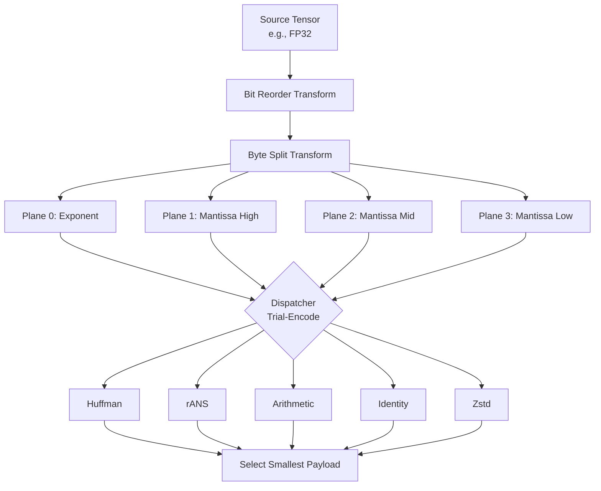

PTWM routes every tensor through a **Chain** — a typed DAG of
preprocessing ops — before entropy coding. The chain transforms the
tensor's bytes into a set of *planes*, and the codec menu encodes each
plane with whichever coder produces the smallest output.

## Nodes

A detailed overview of every node (transform) available in the PTWM Preprocessing Graph can be found in the [Transforms](transforms/) section.

Each chain serialises to bytes that `compress_model` accepts.

## Dispatch

The module `python/ptwm/preprocessing/_chains.py` ships
`PRODUCTION_CHAINS`, a static table that maps each
`(dtype_code, classifier_role)` pair to a list of candidate `Chain`
builders. At compress time:

1. The classifier inspects the tensor (dtype, shape, statistics) and
   produces a role tag.
2. `PRODUCTION_CHAINS[(dtype, role)]` yields one or more candidate chains.
3. The compressor trial-encodes each candidate against the configured
   codec menu. The smallest result wins.

A single tensor can therefore use different chains across the same
checkpoint — the classifier picks, but the compressor verifies by
trial-encoding.

## Extending the chain set

The static `PRODUCTION_CHAINS` table covers the common dtype + role
combinations. To tune compression for an unfamiliar checkpoint, the
explorer (`ExploreOptions` / `explore_chains()`) enumerates more
candidates that get trial-encoded alongside the defaults. Discovered
chains land inline in the resulting `.ptwm` container and decode on any
PTWM install — no source changes required. See the
[tuning guide](/guides/tuning) for the end-user workflow.

## Wire format

The wire format embeds each chain in the per-plane codec dispatch record
of the [`.ptwm` container](/concepts/container). Decoders reconstruct the
chain from its serialised bytes and run the inverse pipeline.
