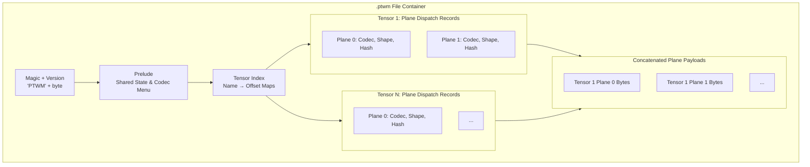

The `.ptwm` file is a multi-tensor container. A single file holds many
tensors with a shared header, a tensor index, and per-plane codec
dispatch.

## Layout

See `crates/ptwm-core/src/compressor.rs` for the exact wire format
fields and field widths.

## Random access

The tensor index is small (a manifest of name → offset records). Opening
a `.ptwm` and fetching one tensor touches only:

1. The header + index (a few KB).
2. The plane records for that tensor (≤ 200 bytes per plane).
3. The plane payloads for that tensor.

Use [`TensorIndex`](/guides/random-access) to do this from Python.

## Hash verification

An xxHash annotates each plane payload. The decoder verifies the hash
before returning bytes to the caller. A mismatch raises
`CompressionMethodNotSupportedError`, which lets callers distinguish
corruption from unsupported features.

## Modes for safetensors input

The `compress_safetensors_file` entry point writes the compressed payload
in one of two shapes; the `mode` argument selects which:

| Mode           | Output                                              | Use when                                                                            |
| -------------- | --------------------------------------------------- | ----------------------------------------------------------------------------------- |
| `"a"` (native) | A `.ptwm` directory with one `.ptwm` blob per shard | You control the loader and want the cleanest random-access surface.                 |
| `"b"` (shell)  | A `.safetensors` shell wrapping a `.ptwm` blob      | You need the result to look like a regular `.safetensors` file to existing tooling. |

Both modes round-trip through PTWM. Mode `b` is what the
[safetensors integration](/guides/safetensors) emits by default.
