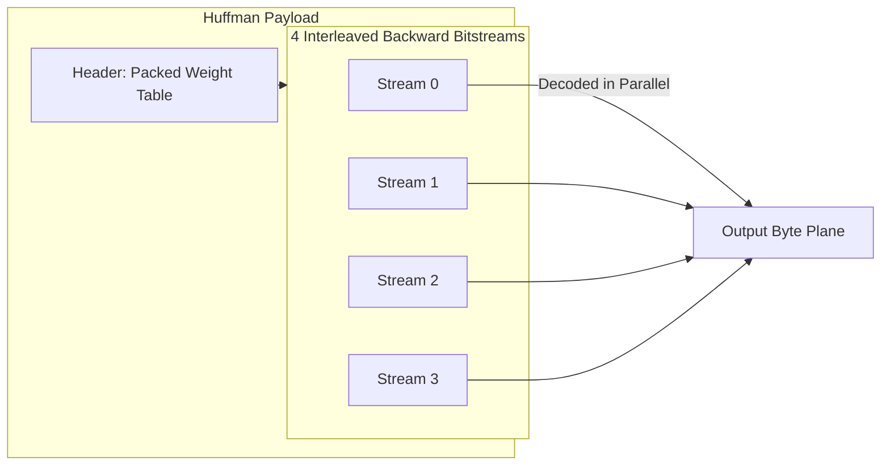

# Huffman Codec

The `Huffman` codec provides canonical Huffman entropy coding for PTWM planes. It is one of the two peer byte coders (along with [rANS](rans)) in the dispatcher.

## Theory

Huffman coding assigns variable-length prefix codes to symbols based on their frequency. More frequent symbols receive shorter codes, reducing the overall file size. 

PTWM's implementation is heavily optimized for performance:

- It uses a canonical Huffman formulation.
- The weight table is nibble-packed.
- It writes to four interleaved backward bitstreams, allowing the decoder to execute fused parallel decodes.

The `Huffman` codec is typically selected by the compressor's trial-encoding dispatcher when it yields a smaller payload than `rANS` on a specific plane.

## Usage

This codec accepts any plane descriptor and operates directly on raw bytes. It guarantees a raw fallback if the data is incompressible.

## References

* David A. Huffman, "A Method for the Construction of Minimum-Redundancy Codes", *Proceedings of the IRE* (1952). [Link](https://ieeexplore.ieee.org/document/1697831)
