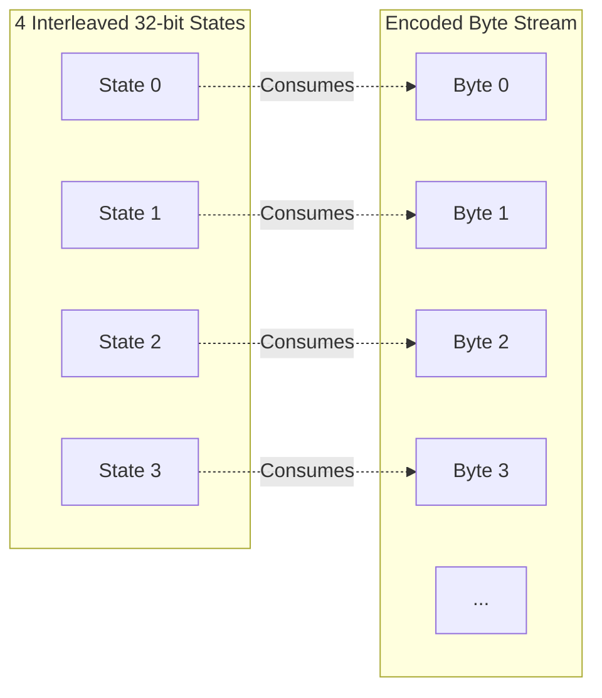

# rANS Codec

The `rANS` (range-ANS) codec is a high-precision entropy coder that acts as a peer to the [Huffman](huffman) coder in the PTWM dispatcher.

## Theory

Asymmetric Numeral Systems (ANS) offers a compression ratio close to arithmetic coding with a decoding speed comparable to Huffman coding. PTWM's implementation uses 11-bit precision and features four interleaved 32-bit streams.

rANS is particularly effective on planes with very low entropy or highly skewed distributions (e.g., long runs of zeros after a Move-To-Front transform), where Huffman's 1-bit-per-symbol minimum becomes a bottleneck. The compressor's dispatcher will trial-encode every plane and select `rANS` if it produces a smaller payload than `Huffman`.

## Usage

This codec accepts any plane descriptor. It includes a raw fallback mechanism to ensure it never expands incompressible data.

## References

* Jarek Duda, "Asymmetric numeral systems: entropy coding combining speed of Huffman coding with compression rate of arithmetic coding" (2013). [Link](https://arxiv.org/abs/1311.2540)
