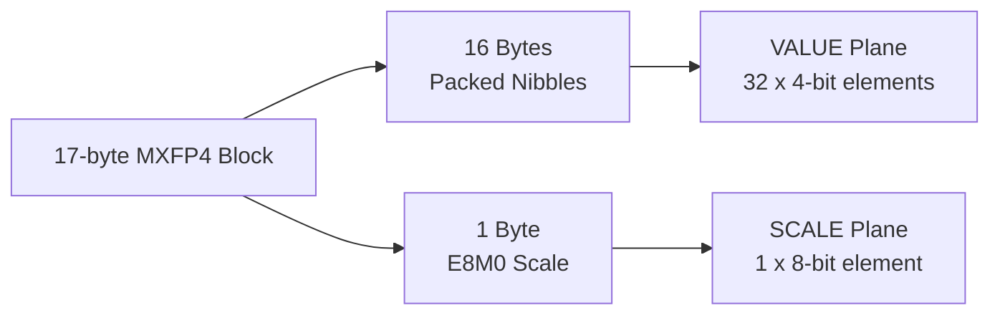

# MxFp4 Deinterleave

The `MxFp4Deinterleave` transform explicitly unpacks interleaved microscaled formats (specifically OCP MXFP4).

## Theory

The OCP MXFP4 format typically packs data in 32-element blocks consisting of 17 bytes: 16 bytes of packed nibbles (containing 32 4-bit values) and 1 byte of E8M0 scale data. 

To effectively compress this layout, the transform deinterleaves the block into two distinct planes:

Splitting these planes is critical because the nearly uniform random `VALUE` nibbles require different codecs (like [Per-Group Codebook](../codecs/per-group-codebook)) than the highly correlated `SCALE` bytes.

## Inverse

The inverse operation recombines the two planes, packing every 32 nibbles and 1 scale byte back into the rigid 17-byte interleaved MXFP4 block format.

## References

* OCP Microscaling Formats (MX) Specification v1.0. [Link](https://www.opencompute.org/documents/ocp-microscaling-formats-mx-v1-0-spec-pdf)
